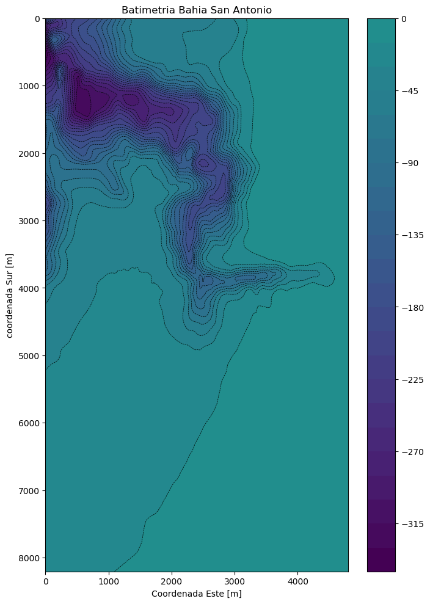

#### 
<hr style="height:2px;border:none"/>
<h1 align='center'> CIV-348 Obras Marítimas - 2019-2 </h1>

<H3 align='center'> Tarea 2   </H3>
<H3 align='center'> Diego Umañana-Jorge Nuñez  </H3>
<H3 align='center'> Bastian Vasquez-Rodrigo Villalobo  </H3>
<hr style="height:2px;border:none"/>


## Tarea 2: Refracción.

En el archivo adjunto se encuentrán los datos de la batimetria de sector de  San Antonio, el archivo consta de 3 columnas, la primera corresponde a la coordenada Este (medida de Oeste a Este), la segunda corresponde a la coordenada Sur (medida de Sur a Norte) ambas en metro. La tercera corresponde a la profundidad den metros (z positivo hacia abajo).
Utilizando estos datos se deberá hacer un análisis de refracción y número de ondas para dicho sector.

Para ello deberán generar un programa de seguimiento de rayos sencillos, basado en la ecuación de Snell, y utilizando la ecuación de dispersión. Esto significa que debe indicar la trayectoria que siguiria una ola al propagarse sobre dicha batimetría.


Deben considerar oleajes provenientes desde aguas profundas, con ángulos desde el Oeste, Sur-Oeste y Nor-Oeste. Como mínimo, deben realizar la propagación desde los puntos con coordenadas (pero pueden incluir más si así lo desean).
Dederán hacer el análisis con dos períodos, 14 y 25 segundos.


```python
import pandas as pd
import numpy as np
import matplotlib.mlab
from scipy.interpolate import griddata
import matplotlib.pyplot as plt
```

#### A continuación se carga la data para ser analizada posteriormente.


```python
df = pd.read_csv('MyMatrix.csv')
```


```python
df.describe()
```


<div>
<style scoped>
    .dataframe tbody tr th:only-of-type {
        vertical-align: middle;
    }

    .dataframe tbody tr th {
        vertical-align: top;
    }

    .dataframe thead th {
        text-align: right;
    }
</style>
<table border="1" class="dataframe">
  <thead>
    <tr style="text-align: right;">
      <th></th>
      <th>Coord.Este[m]</th>
      <th>Coord.Sur[m]</th>
      <th>Profundidad[m]</th>
    </tr>
  </thead>
  <tbody>
    <tr>
      <th>count</th>
      <td>49395.000000</td>
      <td>49395.000000</td>
      <td>49395.000000</td>
    </tr>
    <tr>
      <th>mean</th>
      <td>2402.212432</td>
      <td>4102.611086</td>
      <td>44.424466</td>
    </tr>
    <tr>
      <th>std</th>
      <td>1394.449047</td>
      <td>2377.555758</td>
      <td>65.808872</td>
    </tr>
    <tr>
      <th>min</th>
      <td>0.000000</td>
      <td>0.000000</td>
      <td>0.000000</td>
    </tr>
    <tr>
      <th>25%</th>
      <td>1201.110000</td>
      <td>2035.880000</td>
      <td>0.020000</td>
    </tr>
    <tr>
      <th>50%</th>
      <td>2402.210000</td>
      <td>4102.610000</td>
      <td>21.230000</td>
    </tr>
    <tr>
      <th>75%</th>
      <td>3603.320000</td>
      <td>6169.340000</td>
      <td>45.500000</td>
    </tr>
    <tr>
      <th>max</th>
      <td>4804.420000</td>
      <td>8205.220000</td>
      <td>338.530000</td>
    </tr>
  </tbody>
</table>
</div>


```python
df.head(10)

```


<div>
<style scoped>
    .dataframe tbody tr th:only-of-type {
        vertical-align: middle;
    }

    .dataframe tbody tr th {
        vertical-align: top;
    }

    .dataframe thead th {
        text-align: right;
    }
</style>
<table border="1" class="dataframe">
  <thead>
    <tr style="text-align: right;">
      <th></th>
      <th>Coord.Este[m]</th>
      <th>Coord.Sur[m]</th>
      <th>Profundidad[m]</th>
    </tr>
  </thead>
  <tbody>
    <tr>
      <th>0</th>
      <td>0.0</td>
      <td>0.00</td>
      <td>156.15</td>
    </tr>
    <tr>
      <th>1</th>
      <td>0.0</td>
      <td>30.85</td>
      <td>186.31</td>
    </tr>
    <tr>
      <th>2</th>
      <td>0.0</td>
      <td>61.69</td>
      <td>234.64</td>
    </tr>
    <tr>
      <th>3</th>
      <td>0.0</td>
      <td>92.54</td>
      <td>282.31</td>
    </tr>
    <tr>
      <th>4</th>
      <td>0.0</td>
      <td>123.39</td>
      <td>296.46</td>
    </tr>
    <tr>
      <th>5</th>
      <td>0.0</td>
      <td>154.23</td>
      <td>304.61</td>
    </tr>
    <tr>
      <th>6</th>
      <td>0.0</td>
      <td>185.08</td>
      <td>305.49</td>
    </tr>
    <tr>
      <th>7</th>
      <td>0.0</td>
      <td>215.93</td>
      <td>299.63</td>
    </tr>
    <tr>
      <th>8</th>
      <td>0.0</td>
      <td>246.77</td>
      <td>295.32</td>
    </tr>
    <tr>
      <th>9</th>
      <td>0.0</td>
      <td>277.62</td>
      <td>292.47</td>
    </tr>
  </tbody>
</table>
</div>


```python
df.isnull().sum()
```


    Coord.Este[m]     0
    Coord.Sur[m]      0
    Profundidad[m]    0
    dtype: int64


**Comentario :** Se puede observar que la data no contiene datos faltantes.

#### Descripción del DataFrame MyMatrix.
Esta data contiene los datos de profundidad de la bahia de San Antonio, registradas geograficamente o sea cada medición se registra en conjunto a su coordenada Este [m]  y coordenada Sur [m].

|Columns                    | Descripción                           |
|:------------------------- |:------------------------------------- |
|Coord.Este[m]              | Corresponde a la coordenadada Este del punto de medición [m] |
|Coord.Sur[m]               | Corresponde a la coordenadada Sur del punto de medición [m]   |
|Profundidad[m]             | Profundidad del punto de medición positiva [m]     |

#### Acontinuación se designan las variables Este , Sur y Prof  extraidas de la data para su posterior uso.


```python
Este = list(df['Coord.Este[m]'])
Sur = list(df['Coord.Sur[m]'])
Prof = list(df['Profundidad[m]'])
```

#### Coordenadas iniciales y finales Sur y Este.


```python
sur_end = df['Coord.Sur[m]'][49394]
sur_in = df['Coord.Sur[m]'][0]
este_end = df['Coord.Este[m]'][49394]
este_in = df['Coord.Este[m]'][0]
```

#### A continuación se raliza la grilla de la zona de estudio en la que se trata de mantener los pasos de los registros originales en coordenadas Este y Sur.


```python
# construcción de la grilla 2D
si = np.linspace(sur_in, sur_end,266)
ei = np.linspace(este_in, este_end,185)
S, E = np.meshgrid(si, ei)
```

#### La función griddata interpola los valores asociados a la grilla, dado los valores originales de los registros.


```python
Z = griddata((Sur, Este), Prof,( S, E), method='linear')
```

#### Se gráfica la batimetria de la zona de estudio.


```python
fig = plt.figure(figsize=(8,12), dpi=100)

ax = plt.gca()
ax.invert_yaxis()

plt.contour(ei, si, -Z.transpose(), 30, linewidths=0.5, colors='k')
plt.contourf(ei, si, -Z.transpose(), 30,
                vmax=abs(Z).max(), vmin=-abs(Z).max(),zorder =1)
plt.colorbar()  # draw colorbar

plt.title('Batimetria Bahia San Antonio' )#% npts)
plt.xlabel('Coordenada Este [m]')
plt.ylabel('coordenada Sur [m]')

plt.show()

```




